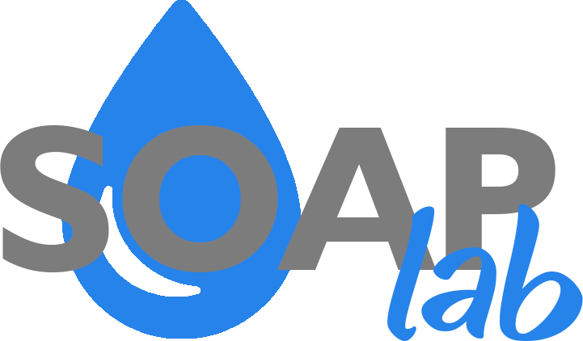

# Soap Lab - Frontend

## O repositório "Máquina de Sabão - Frontend" contém o aplicativo desenvolvido na disciplina de Projeto Integrador 2, no 1º semestre de 2019.

### 1. Descrição do projeto

O projeto "Soap lab" tem como intuito oferecer uma alternativa sustentável ao descarte indevido de óleo vegetal caseiro. A máquina recebe como insumo óleo vegetal que seria descartado, e juntamente com alguns outros ingredientes, produz uma quantidade de sabonete líquido que pode ser utilizado posteriormente. O aplicativo frontend atua como interface de usuário para controle da máquina, além de oferecer funcionalidades úteis como histórico de fabricações anteriores, e gráficos comparativos da economia provida por utilizar o sabão produzido pela máquina.

### 2. Tecnologias

#### 2.1 React Native

React Native é uma tecnologia que utiliza Javascript e React para construção de aplicações mobile. Usa o mesmo design do React, permitindo a construção de aplicações mobile usando componentes declarativos.(https://facebook.github.io/react-native/).

#### 2.2. Backend

O repositório do backend da aplicação pode ser encontrado aqui: https://github.com/pi2-fga/201901-MaquinaSabao-Backend.

### 3. Módulos

#### 3.1 Fabricação

A máquina oferece uma interfece simples e integrada para iniciar um processo de fabricação. Você pode visualizar a quantidade de insumos em cada reservatório, selecionar as quantidades de sabão que deseja fabricar, e, através de uma fotografia tirada na hora, avaliar a qualidade do óleo que está sendo inserido na máquina e receber uma previsão de informações a respeito da qualidade do sabão que será gerado.

#### 3.2 Históricos

A máquina oferece um relatório de fabricações anteriores com informações relevantes, tais como data, hora, quantidade de sabão produzido, qualidade do óleo utilizado, etc. Essas informações também são utilizadas pela própria máquina para evoluir suas capacidades de avaliação e predição.

#### 3.3 Economia

A máquina oferece relatórios detalhados sobre a economia pessoal gerada ao utilizar a máquina. Além disso, exibe informações sobre insumos mais baratos e gráficos ao longo do tempo do quanto está economizando e quanto estaria gastando se estivesse comprando sabão ao invés de produzí-lo. Fora a ajuda oferecida ao ambiente por não estar jogando óleo na pia ou na lixeira. 

#### 3.4 Manual de Usuário

O manual de usuário trás instruções detalhadas sobre utilização, limpeza, armazenamento, etc. a respeito da máquina. Sua leitura é extremamente recomendada, para evitar futuros problemas com o aparelho.